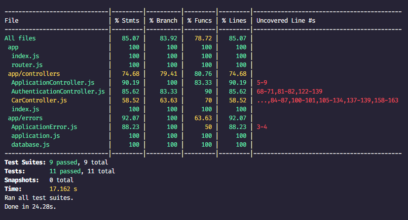

# BCR API

Di dalam repository ini terdapat implementasi API dari Binar Car Rental.
Tugas kalian disini adalah:

1. Fork repository
2. Tulis unit test di dalam repository ini menggunakan `jest`.
3. Coverage minimal 70%

## HTTP request methods

Handle Root (GET) = binarfsw-ch7-production.up.railway.app/
List Car (GET) = binarfsw-ch7-production.up.railway.app/v1/cars
Get Car (GET) = binarfsw-ch7-production.up.railway.app/v1/cars/:id
Create Car (POST) = binarfsw-ch7-production.up.railway.app/v1/cars
Update Car (PUT) = binarfsw-ch7-production.up.railway.app/v1/cars/:id
Delete Car (DELETE) = binarfsw-ch7-production.up.railway.app/v1/cars/:id
Rent Car (POST) = binarfsw-ch7-production.up.railway.app/v1/cars/:id/rent
Login (POST) = binarfsw-ch7-production.up.railway.app/v1/auth/login
Register (POST) = binarfsw-ch7-production.up.railway.app/v1/auth/register
Who Am I (GET) = binarfsw-ch7-production.up.railway.app/v1/auth/whoami

## Test Results

Good luck!
